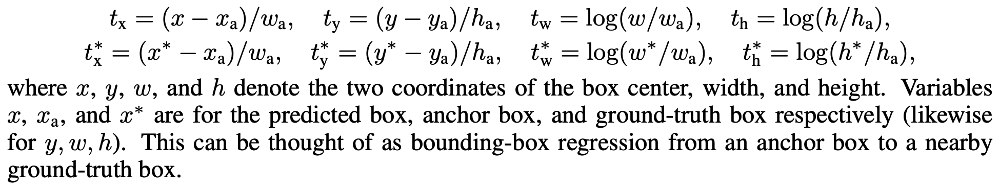
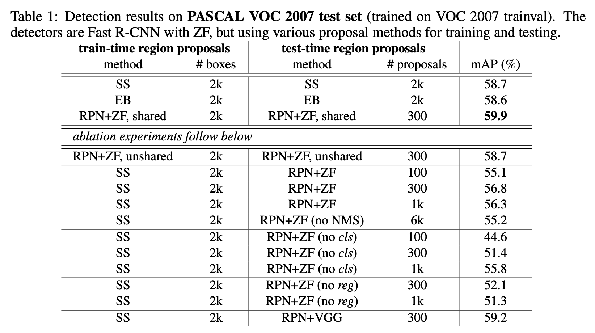
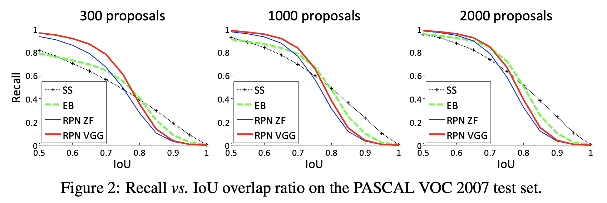

# Faster R-CNN: Towards Real-Time Object Detection with Region Proposal Networks

- Author
  - Shaoqing Ren, Kaiming He, Ross Girshick, Jian Sun
  - Microsoft Research
- Title of Conference(Journal)
  - NIPS 2015

## Abstract

- Region proposal이 최신 detection network들의 병목.
- Region Proposal Network (RPN)이라는 네트워크를 제안함. 
  - 각각의 위치에 대해 object bound와 objectness score를 동시에 예측하는 네트워크.
- RPN이 제안한 위치에 집중해서 Fast R-CNN이 detection.
- 기존 방법들에 비해 빠르고 정확하며 proposal의 수도 훨씬 적게 나온다. 

## 1. Introduction

- 최신 object detection method들은 region proposal에서 심각한 병목이 있는 상황. 
- Object detection 네트워크와 convolutional layer들을 공유하는 RPN이라는 새로운 방법을 제안함. 
- Fast R-CNN과 같은 영역 기반 detector들에서 사용하는 conv feature map들을 region proposal들을 생성하는 데도 사용할 수 있다는 것이 핵심. 
- RPN은 conv feature들 위에 있는 두 개의 conv layer들로 이루어짐.
  - 하나는 conv map의 각 위치를 짧은(e.g., 256-d) feature vector로 인코딩.
  - 다른 하나는 conv map의 각 위치마다, 개의 region proposal에 대한 objectness score와 regress된 bound를 출력.
- RPN은 FCN의 일종으로 볼 수 있음.
- Training 단계에서는 region proposal에 대한 fine-tuning과 object detection에 대한 것을 번갈아 가면서 한다. 

## 2. Related Work

- Skip.

## 3. Region Proposal Networks

- Region Proposal Network (RPN)은 임의 크기의 이미지를 입력으로 갖고 직사각형의 object proposal들과 이들의 objectness score들을 출력으로 갖는다.
- 이 과정을 fully-convolutional network로.

- Region proposal 생성을 위해, 가장 마지막으로 공유되는 conv layer에서 나온 feature map 위에 작은 네트워크를 둔다.
- 이 네트워크는 입력으로 들어온 feature map의  spatial window 에 대해 fully connected. (논문에서 )
- 각 sliding window는 lower-dimensional vector에 대응.
- 이 vector가 box-regression layer (reg)와 box-classification layer (cls)라는 두 개의 fully-connected layer의 입력이 된다.
- 구현은  conv layer (+ReLU) 하나 뒤에  conv layer 두 개가 오는 식으로. 

### Translation-Invariant Anchors

- 각 sliding-window 위치에서 개의 region proposal이 예측된다.
  - 따라서 reg layer에서는 개의 박스들의 좌표를 나타내는 개의 값이 나오고, cls layer에서는 object일 확률과 그렇지 않을 확률을 나타내는 개의 값이 나온다. 
- Anchor라고 불리는 개의 reference box들을 기준으로 proposal이 생성된다. 
  - 각 anchor는 sliding window의 중심에 위치해 있으며, 크기와 가로세로 비율이 서로 다르다. 
  - 이런 방식은 translation invariant해서, 그렇지 않을 때에 비해 훨씬 효율적이다.

### A Loss Function for Learning Region Proposals

- RPN의 학습을 위해 각각의 anchor에 대해 object인지 아닌지를 나타내는 binary class label을 단다.

- Positive label이 붙는 상황은 다음 두 가지 경우 중 하나.

  - Ground-truth box와의 Intersection-over-Union (IOU)가 가장 높은 anchor(들).
  - 어떤 ground-truth box와의 IOU가 0.7을 넘는 anchor.

- Negative label은 모든 ground-truth box와의 IOU가 0.3 미만인 anchor.

- 나머지는 training 과정에서 사용하지 않음.

- 하나의 이미지에 대한 loss는 다음과 같이 정의됨.

  =\frac{1}{N_{cls}}\sum_iL_{cls}(p_i,p_i^*)+\lambda\frac{1}{N_{reg}}\sum_ip_i^*L_{reg}(t_i,t_i^*))

  - 는 mini-batch 내에서 anchor의 index
  - 는 RPN의 objectness 예측값, 는 ground-truth.
  - 는 예측된 bounding box의 좌표값을 나타내는 4D vector, 는 ground-truth. (positive anchor일 때만)
  - 는 object인지 아닌지에 대한 log loss.
  - =R(t_i-t_i^*)). 은 Fast R-CNN에서 사용된 smooth L1 함수다.

- Regression을 위해 네 좌표를 anchor에 대해 매개변수화한다. 왜 이런 짓을 하는지는 [R-CNN 논문](https://www.cv-foundation.org/openaccess/content_cvpr_2014/papers/Girshick_Rich_Feature_Hierarchies_2014_CVPR_paper.pdf)에 나와 있다. 

- 개의 regressor가 weight값을 모두 따로 가진다.

### Optimization

- SGD를 이용해 학습.
- 각 mini-batch는 한 이미지에서 나오는 여러 개의 positive/negative anchor들로 이루어진다.
- 모든 anchor에 대해서 학습하면 negative anchor들이 훨씬 더 많아서 bias가 생기기 때문에, 한 이미지에 있는 256개의 anchor들을 랜덤으로 샘플링해서 mini-batch를 구성하는데, 이 때 positive와 negative anchor들의 비율을 1:1로 맞춘다.
  - 만약 positive sample의 수가 128개가 안 되면 빈 자리는 negative sample로 채운다.
- 학습 전에 모든 새로운 layer들의 weight을 zero-mean Gaussian distribution으로 초기화한다. std=0.01.
- 다른 layer들, 즉 공유 layer들은 ImageNet classification을 위해 pre-train된 애를 사용. 
- 60k개의 mini-batch들에 대해 lr = 0.001
- 20k개의 mini-batch들에 대해 lr = 0.0001
- momentum = 0.9, weight decay = 0.0005

### Sharing Convolutional Features for Region Proposal and Object Detection

- Detection network는 Fast R-CNN의 것을 사용했다. 

- RPN과 Fast R-CNN은 따로 학습되기 때문에 conv layer들을 서로 다른 방식으로 수정한다.

- Fast R-CNN의 학습은 고정된 object proposal에 의존하기 때문에, Fast R-CNN을 학습시키면서 proposal 매커니즘을 변경하면 제대로 converge하지 않을 가능성이 높다.

- 이 optimization은 future work로 미루고, 여기서는 alternating optimization을 통해 shared feature들을 최대한 잘 학습시키는 알고리즘을 제안한다.

  1. 먼저 RPN을 앞서 서술한 대로 학습시킨다. 이 네트워크는 ImageNet으로 pre-train된 모델로 초기화되어 있고, region proposal을 학습하면서 전체적으로 fine-tune된다. 

  2. 1단계 RPN이 생성한 proposal들을 바탕으로, 분리된 detection network를 Fast R-CNN으로 학습시킨다. 이 때도 역시 ImageNet으로 pre-train된 모델로 초기화시킨다. 이 단계까지는 conv layer들을 공유하지 않는다.
  3. Detector network를 RPN 초기화에 사용한다. 이 때, conv layer들을 고정시켜 놓고 RPN에 대해서만 fine-tune한다. 
  4. Conv layer들을 고정된 채로 두고, Fast R-CNN의 fc layer들만 fine-tune한다.

### Implementation Details

- 전 과정에서 single-scale 이미지들만 사용했음. 이미지의 짧은 쪽이 600픽셀이 되도록 rescale함.
  - multi-scale feature 추출이 정확도를 올릴 수는 있으나 속도-정확도 trade-off에서 별로 좋지 않다.
- Anchor에 대해서는 128^2, 256^2, 512^2 픽셀의 세 크기를 사용했고, 1:1, 1:2, 2:1의 세 비율을 사용했다. 
  - 여기서 짚고 넘어가야 할 것은, receptive field보다 큰 anchor box를 proposal에 사용할 수도 있다는 점. 즉, 지금 보고 있는 부분이 커다란 object의 중심부라고 추론할 수도 있다.
  - 이렇게 하면 multi-scale feature나 multi-scale sliding window를 필요로 하지 않게 되어 런타임을 줄여 준다.
- 이미지 경계를 지나가는(cross-boundary) anchor들은 training 단계에서 무시했다. 
  - 이들을 포함하면 오류가 많아지고 training이 converge하지 않는다.
  - 그러나 test 단계에서는 제한을 두지 않았다.
- 어떤 proposal들은 크게 겹칠 수도 있다.
  - cls 점수 기반으로 non-maximum suppression (NMS) 을 적용했다. IoU = 0.7.
  - proposal의 수를 크게 감소시키면서도 정확도는 유지했다.

## 4. Experiments

- Pascal VOC 2007과 2012 detection benchmark에서 평가했다. 각각 5k개의 trainval과 test 이미지가 있으며 20개의 object 카테고리가 있음. 
- ImageNet pre-trained network로는 ZF net과 VGG-16 model 사용.
- 주요 지표로 mean Average Precision (mAP) 사용.

- Table 1의 위쪽은 Fast R-CNN에 다양한 방법을 적용했을 때의 결과이다. 이 결과들은 ZF net을 사용했다.
- Selective Search (SS)나 EdgeBoxes(EB)에 비해 mAP도 높게 나오고 (59.9%) proposal의 수도 크게 감소했다. 
- 속도도 더 빨랐는데, 첫째로 conv 연산을 공유했기 때문이고, 둘째로 proposal이 적어 region-wise fc 비용이 감소했기 때문이다.

#### Ablation Experiments

- 먼저, RPN과 Fast R-CNN이 conv layer들을 공유하는 것의 효과에 대해 살펴봤다.
  - 4-step training 과정 중 두 번째 과정 이후에서 멈춘 뒤, 분리된 네트워크를 사용했더니 결과가 살짝 나빠졌다. (Table 1에서 RPN+ZF, unshared. 58.7%)
  - 이유는 세 번째 단계에서 detector-tuned feature들이 RPN을 fine-tune하는 과정에서 proposal quality가 좋아지기 때문.
- Fast R-CNN을 학습시킬 때 RPN의 영향을 배제해 봤다.
  - 2k개의 SS proposal과 ZF net으로 Fast R-CNN을 학습시켰다. 
  - 그런 후 test 단계에서는 이 detector를 고정시켜 놓고 RPN proposal (300개)을 사용하도록 했다.
  - 이 경우 training과 testing proposal 간의 inconsistency로 인해 성능이 약간 감소했다. (56.8%)
  - 이 뒤로 나오는 모든 abalation experiment들은 이것을 baseline으로 한다.
- 가장 점수가 높은 100개의 proposal만 사용했을 때도 괜찮은 결과(55.1%)가 나왔다. 점수가 높은 proposal들이 꽤 정확하다는 뜻.
- 또, NMS를 사용하지 않았을 때와 비슷한 정확도(55.2%)를 보였다. NMS가 정확도와의 타협 없이도 proposal의 수를 효과적으로 줄인다는 것을 확인할 수 있다.
- 이번에는 test-time에서 cls와 reg을 번갈아 꺼 봄으로써, 각 output의 역할에 대해 조사했다.
  - cls을 제거했을 때는 NMS/ranking을 사용할 수 없으므로 region들 중 N개를 랜덤으로 샘플링했다.
  - N=1k에서는 별 차이가 없었지만(55.8%), N=100에서 크게 감소(44.6%)했다.
  - 즉, cls 점수가 꽤나 큰 역할을 한다.
  - 또, reg layer를 제거했더니 (proposal은 anchor box를 그대로 사용) mAP가 52.1%로 떨어졌다.
  - 즉, anchor box만으로는 정확한 detection을 수행하기 어렵다.
- ZF net 대신 VGG net을 쓰니 mAP가 56.8% -> 59.2%로 올라갔다.

#### Detection Accuracy and Running Time of VGG-16

- Proposal과 detection에 대해 VGG-16을 사용했다.
- Unshared 버전에서는 SS 버전보다 약간 더 높은 결과(66.9% -> 68.5%)를 보였다. RPN+VGG가 생성한 proposal이 SS보다 더 정확하기 때문.
- Shared 버전에서는 더욱 좋은 성능을 내, VOC 2007 테스트셋에서는 73.2%까지, 2012에서는 70.4%의 mAP를 얻을 수 있었다.

- VGG-16 기준, 전체 시스템이 동작하는 데 198ms밖에 안 걸렸는데 그마저도 RPN의 연산은 그 중 겨우 10ms밖에 되지 않는다. Proposal의 수가 적어 region-wise 연산도 SS에 비해 더 빠르게 수행한다.

#### Analysis of Recall-to-IoU

- 여러 가지 IoU 비율을 가지고 recall을 비교해 봤는데, 관련 연구들에서 Recall-to-IoU metric은 정확도에 큰 영향을 주지 않음이 밝혀졌으므로 그냥 분석 용도로 비교해 봤다.
- Proposal의 수가 적을수록 다른 방법들(SS, EB)과의 격차가 크게 벌어졌다. 앞서 살펴봤듯 이는 CPN의 cls 점수 덕분이다.

#### One-Stage Detection vs. Two-Stage Proposal + Detection

- [OverFeat](https://arxiv.org/pdf/1312.6229)에서도 conv feature map 위에서 sliding window 방식으로 작동하는 regressor와 classifier라는 개념을 제안했다.
- 그러나 OverFeat은 *one-stage, class-specific*한 방식이고 이 논문이 제안한 방식은 *two-stage cascade* 방식. (proposal은 class-agnostic이고, detection만 class-specific)
- OverFeat에서는 region-wise feature가 하나의 sliding window에서 나오며, 이 feature들을 가지고 object의 위치와 종류를 동시에 결정한다.
- RPN에서는 3x3 정사각형 sliding window를 사용하며, 서로 다른 크기와 종횡비를 가진 anchor에 상대적인 proposal을 생성한다.
- 두 방식 모두 sliding window를 사용하기는 하지만, RPN은 단지 proposal의 제안만을 수행하고, detector가 region-wise feature를 pooling한다.
- OverFeat 시스템을 에뮬레이트해서 one-stage Fast R-CNN을 만들어서 실험해 본 결과, 정확도와 속도 모두 two-stage가 앞섰다.

## 5. Conclusion

- Region Proposal Network, RPN의 도입으로 빠르고 정확한 region proposal의 생성이 가능해졌다. 
