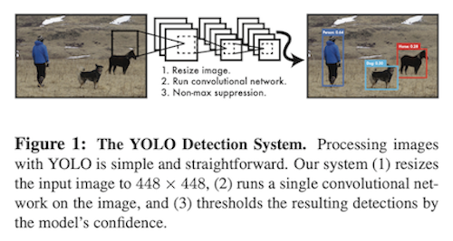
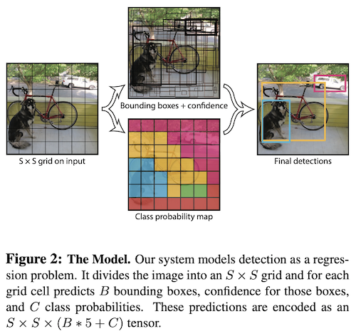
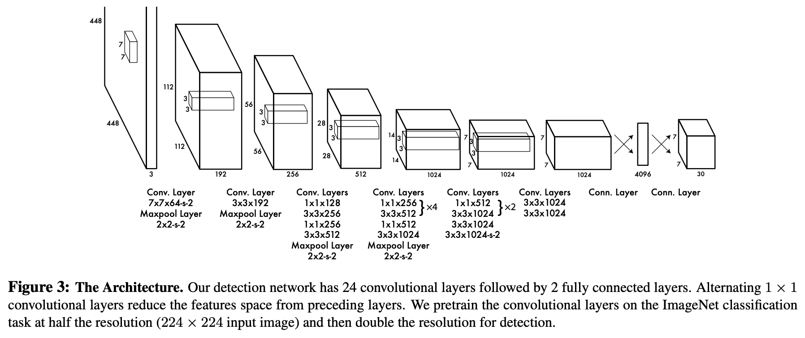
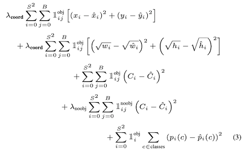

# You Only Look Once: Unified, Real-Time Object Detection

- Author
  - Joseph Redmon, Santosh Divvala, Ross Girshick, Ali Farhadi
- Title of Conference(Journal)
  - CVPR 2016

## Abstract

- 이전 object detection 방식들은 classifier가 detection을 수행하도록 수정했다.
- 이 논문에서는 object detection 문제를 regression 문제로 바라봄. 
- 하나의 네트워크가 bounding box들과 class probability를 한 번의 evaluation만으로 수행. 따라서 최적화에서 유리.
- 통합된 구조를 가졌기에 매우 빠름. 
  - Base YOLO는 45fps, Fast YOLO는 155fps.
  - 와중에 mAP는 다른 real-time detector보다 훨씬 좋음.
- 다른 애들과 비교했을 때'에 비해 localization error는 더 많이 발생하지만 false positive는 더 적다.
- YOLO는 object에 대한 general한 representation을 학습한다.

## 1. Introduction

- 지금의 detection 시스템은 classifier를 detection 용도로 사용한다.
  - 이런 시스템들은 이미지의 다양한 위치와 크기에 대해 object classifier를 적용하는 식으로 작동한다.

- R-CNN과 같은 더 최근의 접근방식은 region proposal이라는 방법을 사용한다.
  - 잠재적인 bounding box (BB)를 생성하고, 이 제안된 box들에 대해 classifier를 적용하는 방식.
  - Classification이 끝나면 후처리를 해서 BB들을 정제한다. 
  - Pipeline이 복잡해서 따로 학습시켜야 하기 때문에, 느리고 최적화가 어렵다. 

- 이 논문에서는 detection을 하나의 regression problem으로 바라봄으로써, 이미지 픽셀에서 BB 좌표와 class probability로 가는 과정을 한번에 쭉 수행한다.

- Figure1을 보면 알 수 있듯 하나의 conv net이 BB들과 class probability들을 내놓는다. 이 간단한 구조 덕분에 여러 가지 이점을 얻을 수 있다.
  - 먼저, 매우 빠르다. 실시간으로 이미지를 처리하면서도 다른 real-time 시스템에 비해 정확도는 훨씬 높다.
  - 두 번째로, 이미지를 global하게 보면서 예측을 수행한다. Fast R-CNN은 큰 맥락을 보지 못해 background를 object로 오인하는 경우가 있지만 YOLO는 이런 경우가 절반 수준으로 적다.
  - 세 번째로, YOLO는 object에 대한 generalizable한 representation들을 학습한다. YOLO를 자연적 이미지들로 학습시킨 뒤 예술작품에 대해 테스트하면, DPM이나 R-CNN에 비해 월등한 성능을 보인다. 따라서 새로운 도메인이나 예상치 못한 input들에 대해 더 잘 작동한다.
- 최신 detection 시스템에 비해 아직은 정확도가 떨어진다. Object의 식별은 잘 하지면 몇몇 작은 object들, 특히 작은 애들에 대해서 정확한 localization이 되지 않기 때문이다. 

## 2. Unified Detection

- Object detection에 사용되는 컴포넌트들을 하나의 neural net으로 통합시켰다.
- 전체 이미지에 대한 feature를 이용해 각각의 BB들과 class들을 동시에 예측한다. 즉, YOLO는 전체 이미지와, 이미지 내의 모든 object들을 포함해, 전체적인 그림을 보고 판단한다. 

- Input image를  grid로 자른다. 만약 object의 중심이 어떠한 grid cell 안에 들어간다면, 그 grid가 그 object의 detection을 맡게 된다.
- 각 grid cell은 개의 BB들과, 그 BB들 각각에 대한 대한 confidence score들을 예측한다. 
  - 이 confidence는 그 BB에 들어 있는 물체가 얼마나 object같은지와, BB가 얼마나 잘 쳐졌는지를 반영한다.
  - Formal하게는 *IOU_{pred}^{truth})로 정의된다.
- 각 BB는 다섯 개의 값을 predict한다.  그리고 confidence.
  - )는 BB의 중심 좌표, 와 는 전체 이미지 크기에 대해 상대적인 값이다. 
  - confidence는 아무 GT box와 예측된 box 사이의 IOU를 나타낸다. 
- 또, 각 grid cell은 개의 조건부 class 확률들, 즉 )를 예측한다. 
  - 이 확률들은 object를 포함하는 grid cell에 대한 것이기 때문에, box의 수 와는 무관하다. 
- 테스트 시에는 조건부 class 확률들과 각각의 box confidence 예측값을 곱한다.
  - *Pr(Object)*IOU_{pred}^{truth}=Pr(Class_i)*IOU_{pred}^{truth})
  - 이렇게 하면 각 box에 대해서 class-specific한 confidence score들이 나오게 된다.
  - 이 점수들은 박스 안에 있는 것이 그 class의 object일 확률과, 그 예측된 box가 얼마나 object에 잘 맞는지에 대한 정보를 동시에 가지고 있다. 
- PASCAL VOC에의 평가에서 을 사용했다. 최종 결과로 나오는 것은  텐서다.

### 2.1. Network Design

- 앞부분에는 conv layer들을 둬서 이미지의 feature들을 뽑아 내고, output probability들과 coordinate들은 fc로 구현됐다.
- 네트워크 구조는 GoogLeNet(image classification)에서 따 왔고, 24개의 conv layer들 뒤에 2개의 fc layer들이 오도록 되어 있다. GoogLeNet에서 사용됐던 inception 모듈 대신  reduction layer들과  conv layer들을 사용했다. 
- Fast version은 24개 대신 9개의 conv layer들만 사용하고, filter의 수도 적게 했다. 이 경우 training과 testing parameter는 base version과 같다. 

### 2.2. Training

- Conv layer들은 ImageNet 1000-class 데이터셋으로 pre-train했다. 
  - Pretrain을 위해 fig. 3의 첫 20개 layer에다 average-pooling layer와 fc layer를 뒀다.
- 그런 다음 모델을 detection을 수행하도록 바꿨다. 
  - 네 개의 conv layer들과 두 개의 fc layer를 추가했으며, weight은 랜덤으로 초기화했다.
  - Detection의 정확도 향상을 위해 네트워크의 input resolution을 에서 로 늘렸다.
- 마지막 layer에서는 class probability들과 BB 좌표들이 출력된다. 
  - BB의 가로세로 크기는 이미지의 가로세로에 대해 상대적인 크기로 나온다. 즉 0~1 사이의 값을 갖는다.
  - BB의 x, y 좌표도 grid cell 위치에 대한 offset이다. 따라서 역시 0~1 사이의 값을 갖는다.
- Activation function은 leaky ReLU 사용. 0보다 작은 값에 대해 의 값을 갖는다.
- Error는 sum-squared error를 사용했다. 
  - localization error와 classification error에 동일한 가중치를 주게 된다. 이는 mAP를 최대화하는 데 가장 이상적인 방법은 아니다. 
  - 하지만 최적화가 용이하다는 점에서 채택했다고 한다.
- 대부분의 grid cell이 object를 포함하고 있지 않으므로, 가끔 object를 포함한 cell까지 전부 confidence score를 0으로 내리는 방향으로 학습하게 될 수도 있다. 
  - 따라서 좌표 예측에 대한 loss는 늘리고, object를 포함하지 않은 BB들의 confidence 예측에 대한 loss는 줄였다. 
  - 이를 위해 두 개의 파라미터, )와 )를 도입했다.
- 또, sum-squared error는 큰 box와 작은 box의 error에 대한 가중치를 같게 준다. 
  - 큰 box에서의 작은 변동이 작은 box에서의 그것보다 더 적은 영향을 미친다는 점을 감안해야 한다.
  - 그래서 BB의 가로세로 크기를 그대로 예측하는 것이 아니라, 제곱근을 취하도록 했다.
- Training시 ground truth와의 IOU가 가장 높은 BB predictor에게 그 object의 예측에 대한 책임을 준다.
- 각 predictor는 학습을 진행하면서 특정한 크기와 종횡비, 또는 class에 최적화된다. 
- 학습 과정에서는 다음 loss 함수를 최적화한다. 

- 은 번째 cell에 object가 나타나는지 여부를 나타내고, 은 번째 cell의 번째 BB predictor가 그 object의 prediction에 책임이 있다는 것을 나타낸다. 
- Loss function은 해당 grid cell에 object가 있는 경우에만 classification error를 주고, 

### 2.3. Inference

### 2.4. Limitations of YOLO

## 3. Comparison to Other Detection Systems

#### Deformable parts models.

#### R-CNN.

#### Other Fast Detectors.

#### Deep MultiBox.

#### OverFeat.

#### MultiGrasp.

## 4. Experiments

### 4.1. Comparison to Other Real-Time Systems

### 4.2. VOC 2007 Error Analysis

### 4.3. Combining Fast R-CNN and YOLO

### 4.4. VOC 2012 Results

### 4.5. Generalizability: Person Detection in Artwork

## 5. Real-Time Detection In The Wild

## 6. Conclusion

