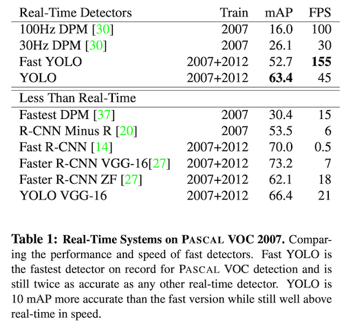
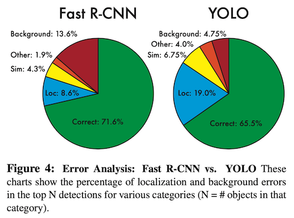
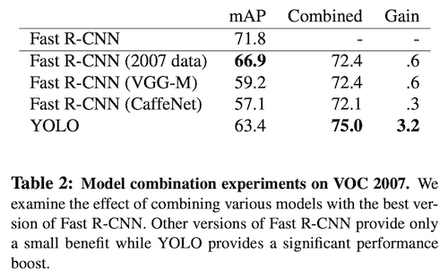
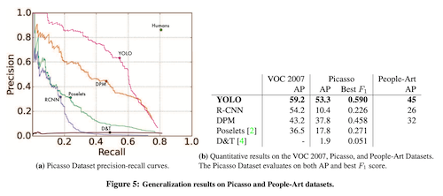

# You Only Look Once: Unified, Real-Time Object Detection

- Author
  - Joseph Redmon, Santosh Divvala, Ross Girshick, Ali Farhadi
- Title of Conference(Journal)
  - CVPR 2016

## Abstract

- 이전 object detection 방식들은 classifier가 detection을 수행하도록 수정했다.
- 이 논문에서는 object detection 문제를 regression 문제로 바라봄. 
- 하나의 네트워크가 bounding box들과 class probability를 한 번의 evaluation만으로 수행. 따라서 최적화에서 유리.
- 통합된 구조를 가졌기에 매우 빠름. 
  - Base YOLO는 45fps, Fast YOLO는 155fps.
  - 와중에 mAP는 다른 real-time detector보다 훨씬 좋음.
- 다른 애들과 비교했을 때'에 비해 localization error는 더 많이 발생하지만 false positive는 더 적다.
- YOLO는 object에 대한 general한 representation을 학습한다.

## 1. Introduction

- 지금의 detection 시스템은 classifier를 detection 용도로 사용한다.
  - 이런 시스템들은 이미지의 다양한 위치와 크기에 대해 object classifier를 적용하는 식으로 작동한다.

- R-CNN과 같은 더 최근의 접근방식은 region proposal이라는 방법을 사용한다.
  - 잠재적인 bounding box (BB)를 생성하고, 이 제안된 box들에 대해 classifier를 적용하는 방식.
  - Classification이 끝나면 후처리를 해서 BB들을 정제한다. 
  - Pipeline이 복잡해서 따로 학습시켜야 하기 때문에, 느리고 최적화가 어렵다. 

- 이 논문에서는 detection을 하나의 regression problem으로 바라봄으로써, 이미지 픽셀에서 BB 좌표와 class probability로 가는 과정을 한번에 쭉 수행한다.

- Figure1을 보면 알 수 있듯 하나의 conv net이 BB들과 class probability들을 내놓는다. 이 간단한 구조 덕분에 여러 가지 이점을 얻을 수 있다.
  - 먼저, 매우 빠르다. 실시간으로 이미지를 처리하면서도 다른 real-time 시스템에 비해 정확도는 훨씬 높다.
  - 두 번째로, 이미지를 global하게 보면서 예측을 수행한다. Fast R-CNN은 큰 맥락을 보지 못해 background를 object로 오인하는 경우가 있지만 YOLO는 이런 경우가 절반 수준으로 적다.
  - 세 번째로, YOLO는 object에 대한 generalizable한 representation들을 학습한다. YOLO를 자연적 이미지들로 학습시킨 뒤 예술작품에 대해 테스트하면, DPM이나 R-CNN에 비해 월등한 성능을 보인다. 따라서 새로운 도메인이나 예상치 못한 input들에 대해 더 잘 작동한다.
- 최신 detection 시스템에 비해 아직은 정확도가 떨어진다. Object의 식별은 잘 하지면 몇몇 작은 object들, 특히 작은 애들에 대해서 정확한 localization이 되지 않기 때문이다. 

## 2. Unified Detection

- Object detection에 사용되는 컴포넌트들을 하나의 neural net으로 통합시켰다.
- 전체 이미지에 대한 feature를 이용해 각각의 BB들과 class들을 동시에 예측한다. 즉, YOLO는 전체 이미지와, 이미지 내의 모든 object들을 포함해, 전체적인 그림을 보고 판단한다. 

- Input image를  grid로 자른다. 만약 object의 중심이 어떠한 grid cell 안에 들어간다면, 그 grid가 그 object의 detection을 맡게 된다.
- 각 grid cell은 개의 BB들과, 그 BB들 각각에 대한 대한 confidence score들을 예측한다. 
  - 이 confidence는 그 BB에 들어 있는 물체가 얼마나 object같은지와, BB가 얼마나 정확하게 쳐졌는지를 반영한다.
  - Formal하게는 *IOU_{pred}^{truth})로 정의된다.
- 각 BB는 다섯 개의 값을 predict한다.  그리고 confidence.
  - )는 BB의 중심 좌표, 와 는 전체 이미지 크기에 대해 상대적인 값이다. 
  - confidence는 아무 GT box와 예측된 box 사이의 IOU를 나타낸다. 
- 또, 각 grid cell은 개의 조건부 class 확률들, 즉 )를 예측한다. 
  - 이 확률들은 object를 포함하는 grid cell에 대한 것이기 때문에, box의 수 와는 무관하다. 
- 테스트 단계에서는 조건부 class 확률들과 각각의 box confidence 예측값을 곱한다.
  - *Pr(Object)*IOU_{pred}^{truth}=Pr(Class_i)*IOU_{pred}^{truth})
  - 이렇게 하면 각 box에 대해서 class-specific한 confidence score들이 나오게 된다.
  - 이 점수들은 박스 안에 있는 것이 그 class의 object일 확률과, 그 예측된 box가 얼마나 object에 잘 맞는지에 대한 정보를 동시에 가지고 있다. 
- PASCAL VOC에의 평가에서 을 사용했다. 최종 결과로 나오는 것은  텐서다.

### 2.1. Network Design

- 앞부분에는 conv layer들을 둬서 이미지의 feature들을 뽑아 내고, output probability들과 coordinate들은 fc로 구현됐다.
- 네트워크 구조는 GoogLeNet(image classification)에서 따 왔고, 24개의 conv layer들 뒤에 2개의 fc layer들이 오도록 되어 있다. GoogLeNet에서 사용됐던 inception 모듈 대신  reduction layer들과  conv layer들을 사용했다. 
- Fast version은 24개 대신 9개의 conv layer들만 사용하고, filter의 수도 적게 했다. 이 경우 training과 testing parameter는 base version과 같다. 

### 2.2. Training

- Conv layer들은 ImageNet 1000-class 데이터셋으로 pre-train했다. 
  - Pretrain을 위해 fig. 3의 첫 20개 layer에다 average-pooling layer와 fc layer를 뒀다.
- 그런 다음 모델을 detection을 수행하도록 바꿨다. 
  - 네 개의 conv layer들과 두 개의 fc layer를 추가했으며, weight은 랜덤으로 초기화했다.
  - Detection의 정확도 향상을 위해 네트워크의 input resolution을 에서 로 늘렸다.
- 마지막 layer에서는 class probability들과 BB 좌표들이 출력된다. 
  - BB의 가로세로 크기는 이미지의 가로세로에 대해 상대적인 크기로 나온다. 즉 0~1 사이의 값을 갖는다.
  - BB의 x, y 좌표도 grid cell 위치에 대한 offset이다. 따라서 역시 0~1 사이의 값을 갖는다.
- Activation function은 leaky ReLU 사용. 0보다 작은 값에 대해 의 값을 갖는다.
- Error는 sum-squared error를 사용했다. 
  - localization error와 classification error에 동일한 가중치를 주게 된다. 이는 mAP를 최대화하는 데 가장 이상적인 방법은 아니다. 
  - 하지만 최적화가 용이하다는 점에서 채택했다고 한다.
- 대부분의 grid cell이 object를 포함하고 있지 않으므로, 가끔 object를 포함한 cell까지 전부 confidence score를 0으로 내리는 방향으로 학습하게 될 수도 있다. 
  - 따라서 좌표 예측에 대한 loss는 늘리고, object를 포함하지 않은 BB들의 confidence 예측에 대한 loss는 줄였다. 
  - 이를 위해 두 개의 파라미터, )와 )를 도입했다.
- 또, sum-squared error는 큰 box와 작은 box의 error에 대한 가중치를 같게 준다. 
  - 큰 box에서의 작은 변동이 작은 box에서의 그것보다 더 적은 영향을 미친다는 점을 감안해야 한다.
  - 그래서 BB의 가로세로 크기를 그대로 예측하는 것이 아니라, 제곱근을 취하도록 했다.
- Ground truth와의 IOU가 가장 높은 BB predictor에게 그 object의 예측을 맡긴다.
- 각 predictor는 학습을 진행하면서 특정한 크기와 종횡비, 또는 class에 최적화된다. 
- 학습 과정에서는 다음 loss 함수를 최적화한다. 
  - 

- 은 번째 cell에 object가 나타나는지 여부를 나타내고, 은 번째 cell의 번째 BB predictor가 그 object의 예측을 담당하는지를 나타낸다.
- 당연한 얘기지만 짚고 넘어가자면, loss function은 해당 grid cell에 object가 있는 경우에만 classification error를 먹인다(즉, 위에서 말했던 조건부 class probability). 
  또, gt box의 예측을 담당하는 predictor(즉, 해당 grid cell에서 IOU가 가장 높은 predictor)에만 coordinate error를 먹인다.
- epochs = 135
  trainval data : Pascal VOC 2007 trainval/test, VOC 2012 trainval.
  test data: Pascal VOC 2012 test
  batch size = 64, momentum 0.9, decay = 0.0005
- 첫 epoch에서 lr을 에서 까지 천천히 올린다. 높은 lr로 시작하면 가끔 불안정한 gradient 때문에 모델이 수렴하지 않는다고 한다.
- 75개의 epoch에서 로 학습시키고, 그 다음 30개 epoch에서 , 마지막 30 epoch에서 로 학습.
- Overfitting을 막기 위해서 dropout과 data augmentation을 적용했다. 
  - 첫 번째 fc 뒤에 dropout layer (rate=0.5) 를 둬서 co-adaptation을 막았다. 
  - 원본 이미지 크기의 최대 20% 수준으로, 랜덤한 scaling과 translation을 했다.
  - 또 이미지의 노출과 채도를 HSV 색공간에서 최대 1.5까지 랜덤으로 조정했다.

### 2.3. Inference

- 테스트 단계에서도 학습 단계와 마찬가지로 한 번의 네트워크 계산으로 끝내기 때문에 매우 빠르다.
- Pascal VOC에서 이미지당 98개의 BB와 각각에 대한 class probability가 예측된다. 
- Grid 기반의 디자인 덕분에 spatial diversity를 달성할 수 있다. 
- 가끔 커다란 object가 나오거나, object가 여러 cell의 경계가 있는 경우에 여러 개의 box가 예측될 수 있다. 
  - Non-Maximal Suppression(NMS)로 이 문제를 해결했으며, 덕분에 2-3% 정도의 mAP 향상이 생겼다.

### 2.4. Limitations of YOLO

- 각 grid cell이 두 개의 box(위에서 로 설정했었다), 그리고 단 하나의 class만 예측하므로 강한 공간적 제약이 발생한다. 
  - 이 공간상의 제약 때문에 YOLO는 가까이 있는 object들을 제대로 판별하지 못한다. (ex. 새 떼)
- BB를 예측할 때 학습된 데이터에 의존하므로, 새롭거나 흔하지 않은 종횡비나 형태가 등장할 때도 힘을 쓰지 못한다.
- 그리고 downsampling layer가 많아서, BB 예측에 있어 상대적으로 coarse한 feature를 사용한다.
- 마지막으로, loss function이 작은 BB와 큰 BB에서의 error를 동일하게 취급한다. 작은 error가 큰 box에서 생겼을 때보다 작은 box에서 생겼을 때에 IOU에 더 큰 영향을 미친다는 점이 반영되지 않는다.
- 부정확한 localization이 error의 가장 큰 원인.

## 3. Comparison to Other Detection Systems

- Detection pipeline은 보통 다음과 같다.
  1. 이미지로부터 feature들을 뽑아 낸다. 
  2. Classifier 또는 localizer가 feature space에서 object들을 찾는다.
     이 때, sliding window 방식 또는 region의 몇 subset에 대해 찾는 방식을 사용한다.

#### Deformable parts models.

- DPM은 sliding window 방식으로 동작한다.
- 여기서는 static feature 추출, region 분류, 높은 점수의 region에 대한 BB 예측 등의 작업들을 분리된 pipeline으로 진행한다. YOLO는 이 모든 과정을 하나의 CNN으로 동시에 수행한다. 
- 또 YOLO는 feature 역시 static한 것을 사용하지 않고, 네트워크가 detection에 맞게 최적화하면서 feature를 학습한다.
- 통합된 구조 덕에 DPM보다 빠르고 정확하다. 

#### R-CNN.

- R-CNN과 그 변형들은 sliding-window 대신 region proposal들을 사용한다. 
- 먼저 Selective Search를 이용해 잠재적인 BB들을 생성하고, CNN이 feature들을 추출한 다음, SVM이 box들에 점수를 매기고, linear model이 BB들을 조정하고, NMS를 적용해 중복을 제거한다. 
- 이 복잡한 pipeline은 독립적으로 조율되어야 하는 데다 결과 네트워크는 매우 느리다(test time에서 이미지당 40초 이상).
- YOLO는 각 grid cell이 conv feature들을 이용해 잠재적 BB 후보들과 얘네에 대한 점수를 제안한다는 점에서 R-CNN과 유사한 면이 있다. 
- 그러나 YOLO에는 공간상의 제약이 있어서, 같은 object에 대한 중복 detection이 적다. 
- 또, 훨씬 적은 BB가 나온다. (2000 vs 98 per image)
- YOLO는 각 컴포넌트를 하나의, 공동으로 최적화된 모델로 합쳤다. 

#### Other Fast Detectors.

- Fast/Faster R-CNN은 연산을 공유하고, region proposal에 SS를 사용하는 대신 nueral net을 사용함으로써 R-CNN의 속도를 높이는 데 주안점을 뒀다. 
  - 그 결과로 속도와 정확도 면에서의 향상이 있었지만 실시간으로 처리 가능한 수준은 아니다.
- DPM의 속도를 높이기 위한 연구도 많았지만, 실시간으로 동작하는 것은 30Hz DPM 밖에 없었다. 
- 커다란 detection pipeline에서 각 부분들을 최적화하려 노력하는 대신 YOLO는 pipeline 자체를 제거했다.

#### Deep MultiBox.

- R-CNN과는 달리, CNN을 학습시켜 region of interest를 예측하는 모델이다. 
- Confidence prediction을 single class prediction으로 대체하면 single object detection도 수행 가능하다.
- 그러나 MultiBox는 일반적인 object detection은 못 하고, 더 큰 detection pipeline의 일부로서만 기능하기에 image patch classification을 필요로 한다. 
- BB 예측에 conv net을 사용한다는 점에서는 YOLO와 유사하지만, YOLO는 완전한 detection system이고 MultiBox는 그렇지 않다.

#### OverFeat.

- Localization을 위해 CNN을 학습시키며, detection에 그 localizer를 적용했다. 
- Sliding window detection을 효과적으로 수행하지만 여전히 분리된 시스템이다. 
- Detection 성능을 위한 것이 아니라 localization을 위한 최적화를 한다.
- DPM처럼 localizer는 local information만 보고 예측하기 때문에 전체적인 맥락을 고려하지 못한다.
  그 때문에 일관성 있는 detection을 위해서는 많은 후처리를 필요로 한다.

#### MultiGrasp.

- YOLO와 디자인 면에서 유사하다.
- BB 예측을 grid 방식으로 접근하는 방식은 MultiGrasp를 기반으로 한다.
- 하지만 grasp detection이 object detection보다 훨씬 간단하다.
  - 하나의 object만 포함하는 이미지에 대해 하나의 graspable region만 예측하면 되기 때문.
  - Object의 크기, 위치, 경계, class를 추정할 필요 없이 grasping에 적당한 region만 찾으면 된다. 

## 4. Experiments

- YOLO와 다른 실시간 detection system들을 Pascal VOC 2007에서 비교한다.
- R-CNN 변형들과의 차이를 이해하기 위해 Fast R-CNN과 error를 비교한다.
  - 이 결과를 바탕으로, 배경에서 발생하는 false positive의 감소 덕에 YOLO가 Fast R-CNN보다 성능이 크게 앞선다는 것을 보인다.
- VOC 2012에서 mAP를 측정하고 다른 최신 방법들과 비교한다.
- 두 개의 예술품 데이터셋을 통해, YOLO가 새로운 도메인에서도 잘 일반화한다는 것을 보인다. 

### 4.1. Comparison to Other Real-Time Systems

- Detection pipeline을 빠르게 하려는 연구가 많았지만 실시간으로 동작하는 것은 30Hz/100Hz DPM이 전부이기에, 얘랑 비교했다.
- Fast YOLO는 Pascal에서 현존하는 가장 빠른 detector.

- 이전의 실시간 detector보다 두 배 이상 높은 mAP(26.1% vs 52.7%)를 보여주며, base 버전의 YOLO는 실시간성을 유지하면서도 mAP를 63.4%까지 올렸다.
- VGG-16을 통해 학습시킨 YOLO는 더 정확하지만 훨씬 느려졌다. 
- Fastest DPM은 mAP의 희생을 많이 하지 않으면서도 DPM의 속도를 효과적으로 올릴 수 있었지만, 실시간에는 동작하지 않으며 neural net 기반의 접근들보다 정확도가 떨어진다.
- R-CNN minus R은 Selective Search를 static BB proposal들로 대체해서 R-CNN보다 빨라졌으나, 역시 실시간 동작이 되지 않으며 proposal들의 상태가 영 좋지 못해 정확도가 낮다.
- Faster R-CNN은 selective search 대신 BB를 제안하는 neural net을 사용했다. VGG-16 버전은 YOLO보다 mAP가 10 높지만 동시에 6배나 느리고, ZF 버전은 YOLO보다 정확도가 떨어지는 데다 2.5배 느리다.

### 4.2. VOC 2007 Error Analysis

- VOC 2007을 통해 Fast R-CNN과 비교해 봤다. 성능도 가장 뛰어난 편에 속하면서 detection들이 공개되어 있기 때문에 선택했다.
- Test time에 각 카테고리에서 상위 N개의 예측들을 살펴봤다. 각 예측은 correct이거나, error의 유형에 따라 분류된다.
  - Correct: correct class and IOU > 0.5
  - Localization: correct class, 0.1 < IOU < 0.5
  - Similar: class is similar, IOU > 0.1
  - Other: class is wrong, IOU > 0.1
  - Background: IOU < 0.1 for any object

- YOLO에서는 다른 error들을 다 합친 것보다 localization 오류가 더 많을 정도로, object의 위치를 제대로 잡지 못하는 모습을 보였다. 
- Fast R-CNN은 localization error는 적었으나 background error가 세 배 가까이 많이 발생했다. 이는 false positive, 즉 object가 없는 곳에 박스를 치는 경우가 많았음을 의미한다.

### 4.3. Combining Fast R-CNN and YOLO

- YOLO가 Fast R-CNN에 비해 background 실수를 훨씬 적게 한다는 점에 착안하여, Fast R-CNN의 결과에다 YOLO를 사용해서 background detection을 제거해 봤더니 성능이 크게 올랐다.
  - R-CNN이 예측한 모든 BB에 대해서 YOLO가 비슷한 box를 치는지를 체크한다.
  - 만약 그렇다면 YOLO가 예측한 확률과, 두 box 사이의 overlap을 기반으로 해, 그 예측에 가중치를 준다. 

- 그 결과로 mAP를 3.2% 올릴 수 있었다.
- Fast R-CNN 모델에 다른 다양한 버전의 Fast R-CNN을 붙여 봤지만 YOLO를 붙였을 때만큼의 향상은 없었다. 
  - 그 이유는 test time에 Fast R-CNN과 YOLO가 내는 실수가 서로 다르기 때문이다. 
- YOLO의 빠른 속도 덕분에 이렇게 붙여 놔도 연산 시간이 별 차이가 없다.

### 4.4. VOC 2012 Results

- VOC에서는 mAP 57.9%로 성능이 많이 떨어진다.
  - 경쟁자들보다 작은 object를 잘 잡지 못하고, 특정 카테고리에서 약하다. 
- 대신 Fast R-CNN + YOLO 모델이 좋은 성능을 보였다. 

### 4.5. Generalizability: Person Detection in Artwork

- 학술적 데이터셋에서는 training과 testing data의 분포가 비슷하다. 
- 실세계에서는 학습한 데이터와 완전히 다른 데이터를 보게 될 수도 있다.
- 그림에서의 person detection 성능을 다른 모델들과 비교해 봤다.

- VOC 2012로 학습된 모델로 Picasso에 테스트했고, VOC 2010으로 학습된 모델로 People-Art에 테스트한 결과다.
- R-CNN의 경우 성능이 크게 감소했는데, 이는 Selective Search가 자연 이미지에 튜닝되어 proposal의 품질이 떨어졌기 때문이다. 
- YOLO는 성능이 별로 감소하지 않았다. Object의 크기와 모양, 그리고 object 간의 관계를 고려하기 때문에, 미술작품과 자연적인 이미지가 픽셀 레벨에서 많은 차이가 있음에도 큰 영향을 받지 않는다.

## 5. Real-Time Detection In The Wild

- 웹캠과 연결했을 때도 마치 tracking system처럼 잘 작동했다. 

## 6. Conclusion

- YOLO라는 object detection을 위한 통합된 네트워크를 도입함.
- 구성이 단순하며 full image로부터 바로 학습시킬 수 있음.
- Classifier 기반의 접근법과는 달리 detection에 대응되는 loss 함수를 사용했고 전체 모델이 다같이 학습함. 

- Fast YOLO는 가장 빠른 일반 목적의 object detector이며, YOLO는 실시간 detector 중 가장 뛰어남.
- YOLO는 또 새로운 domain에도 잘 일반화되므로, 빠르고 robust한 object detection이 필요한 곳에 적용되기 이상적.