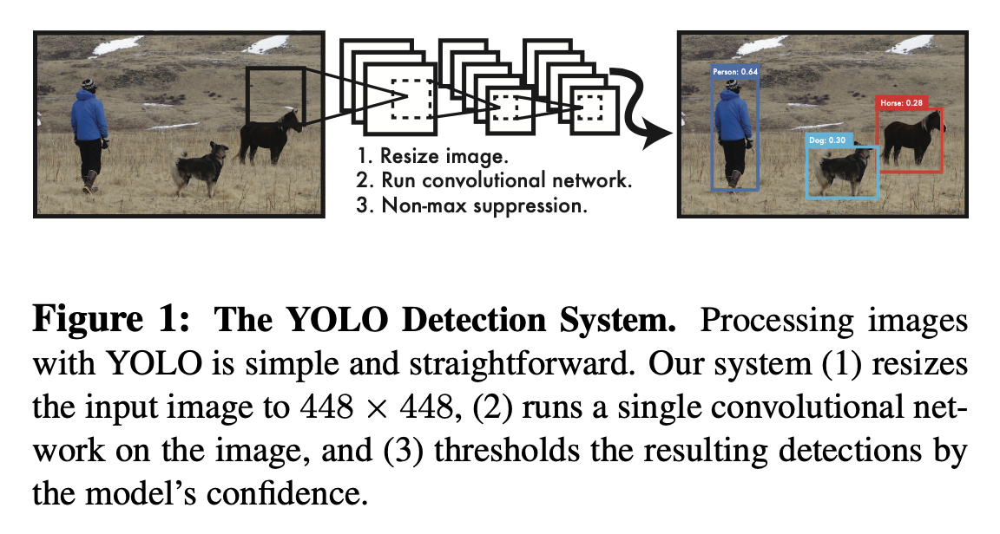

# You Only Look Once: Unified, Real-Time Object Detection

- Author
  - Joseph Redmon, Santosh Divvala, Ross Girshick, Ali Farhadi
- Title of Conference(Journal)
  - CVPR 2016

## Abstract

- 이전 object detection 방식들은 classifier가 detection을 수행하도록 수정했다.
- 이 논문에서는 object detection 문제를 regression 문제로 바라봄. 
- 하나의 네트워크가 bounding box들과 class probability를 한 번의 evaluation만으로 수행. 따라서 최적화에서 유리.
- 통합된 구조를 가졌기에 매우 빠름. 
  - Base YOLO는 45fps, Fast YOLO는 155fps.
  - 와중에 mAP는 다른 real-time detector보다 훨씬 좋음.
- 다른 애들과 비교했을 때'에 비해 localization error는 더 많이 발생하지만 false positive는 더 적다.
- YOLO는 object에 대한 general한 representation을 학습한다.

## 1. Introduction

- 지금의 detection 시스템은 classifier를 detection 용도로 사용한다.
  - 이런 시스템들은 이미지의 다양한 위치와 크기에 대해 object classifier를 적용하는 식으로 작동한다.

- R-CNN과 같은 더 최근의 접근방식은 region proposal이라는 방법을 사용한다.
  - 잠재적인 bounding box (BB)를 생성하고, 이 제안된 box들에 대해 classifier를 적용하는 방식.
  - Classification이 끝나면 후처리를 해서 BB들을 정제한다. 
  - Pipeline이 복잡해서 따로 학습시켜야 하기 때문에, 느리고 최적화가 어렵다. 

- 이 논문에서는 detection을 하나의 regression problem으로 바라봄으로써, 이미지 픽셀에서 BB 좌표와 class probability로 가는 과정을 한번에 쭉 수행한다.

- Figure1을 보면 알 수 있듯 하나의 conv net이 BB들과 class probability들을 내놓는다. 이 간단한 구조 덕분에 여러 가지 이점을 얻을 수 있다.
  - 먼저, 매우 빠르다. 실시간으로 이미지를 처리하면서도 다른 real-time 시스템에 비해 정확도는 훨씬 높다.
  - 두 번째로, 이미지를 global하게 보면서 예측을 수행한다. Fast R-CNN은 큰 맥락을 보지 못해 background를 object로 오인하는 경우가 있지만 YOLO는 이런 경우가 절반 수준으로 적다.
  - 세 번째로, YOLO는 object에 대한 generalizable한 representation들을 학습한다. YOLO를 자연적 이미지들로 학습시킨 뒤 예술작품에 대해 테스트하면, DPM이나 R-CNN에 비해 월등한 성능을 보인다. 따라서 새로운 도메인이나 예상치 못한 input들에 대해 더 잘 작동한다.
- YOLO still lags behind state-of-the-art detection systems in accuracy. While it can quickly identify objects in im- ages it struggles to precisely localize some objects, espe- cially small ones. We examine these tradeoffs further in our experiments.
- 최신 detection 시스템에 비해 아직은 정확도가 떨어진다. Object의 식별은 잘 하지면 몇몇 작은 object들, 특히 작은 애들에 대해서 정확한 localization이 되지 않기 때문이다. 

## 2. Unified Detection

- Object detection에 사용되는 컴포넌트들을 하나의 neural net으로 통합시켰다.
- 전체 이미지에 대한 feature를 이용해 각각의 BB들과 class들을 동시에 예측한다. 즉, YOLO는 전체 이미지와, 이미지 내의 모든 object들을 포함해, global하게 생각한다. 

- Input image를  grid로 자른다. 만약 object의 중심이 어떠한 grid cell 안에 들어간다면, 그 grid가 그 object의 detection을 맡게 된다.
- 각 grid cell은 개의 BB들과, 각 box에 대한 confidence score들을 예측한다. 
  - 이 confidence는 그 BB에 들어 있는 물체가 얼마나 object같은지와, BB가 얼마나 잘 쳐졌는지를 반영한다.
  - Formal하게는 *IOU_{pred}^{truth})로 정의된다.
- 각 BB는 다섯 개의 값을 predict한다.  그리고 confidence.
  - )는 BB의 중심 좌표, 와 는 전체 이미지 크기에 대해 상대적인 값이다. 
  - confidence는 아무 GT box와 예측된 box 사이의 IOU를 나타낸다. 
- 또, 각 grid cell은 개의 조건부 class 확률들, 즉 )를 예측한다. 
  - 이 확률들은 object를 포함하는 grid cell에 대한 것이기 때문에, box의 수 와는 무관하다. 
- 테스트 시에는 조건부 class 확률들과 각각의 box confidence 예측값을 곱한다.
  - *Pr(Object)*IOU_{pred}^{truth}=Pr(Class_i)*IOU_{pred}^{truth})
  - 이렇게 하면 각 box에 대해서 class-specific한 confidence score들이 나오게 된다.
  - 이 점수들은 박스 안에 있는 것이 그 class의 object일 확률과, 그 예측된 box가 얼마나 object에 잘 맞는지에 대한 정보를 동시에 가지고 있다. 

### 2.1. Network Design

### 2.2. Training

### 2.3. Inference

### 2.4. Limitations of YOLO

## 3. Comparison to Other Detection Systems

#### Deformable parts models.

#### R-CNN.

#### Other Fast Detectors.

#### Deep MultiBox.

#### OverFeat.

#### MultiGrasp.

## 4. Experiments

### 4.1. Comparison to Other Real-Time Systems

### 4.2. VOC 2007 Error Analysis

### 4.3. Combining Fast R-CNN and YOLO

### 4.4. VOC 2012 Results

### 4.5. Generalizability: Person Detection in Artwork

## 5. Real-Time Detection In The Wild

## 6. Conclusion

