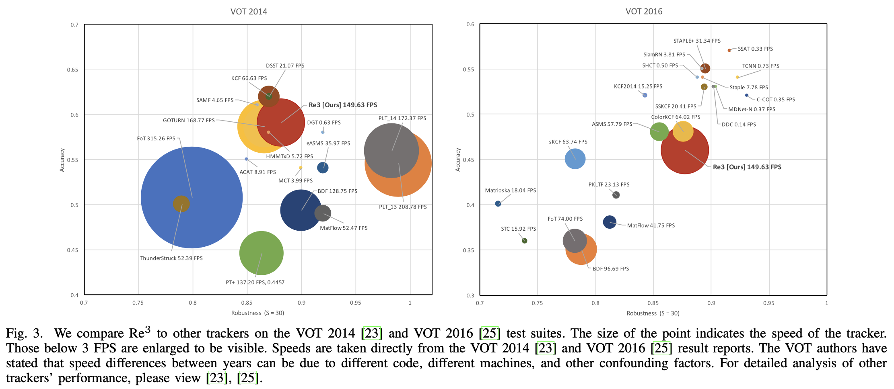
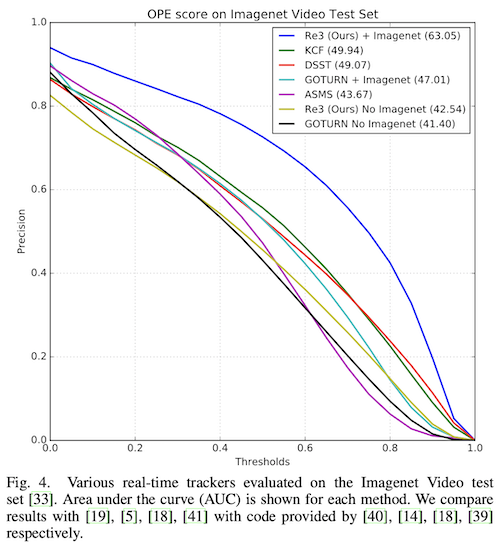
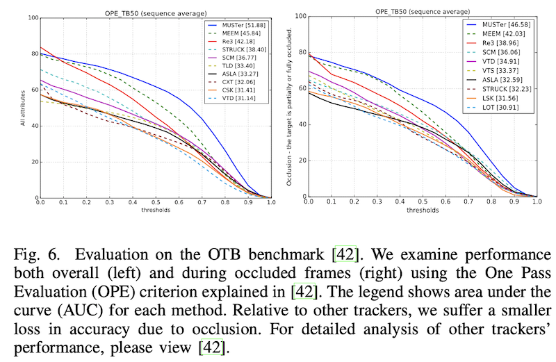
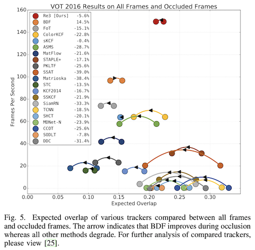
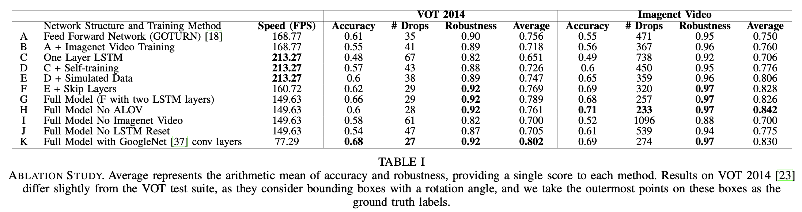
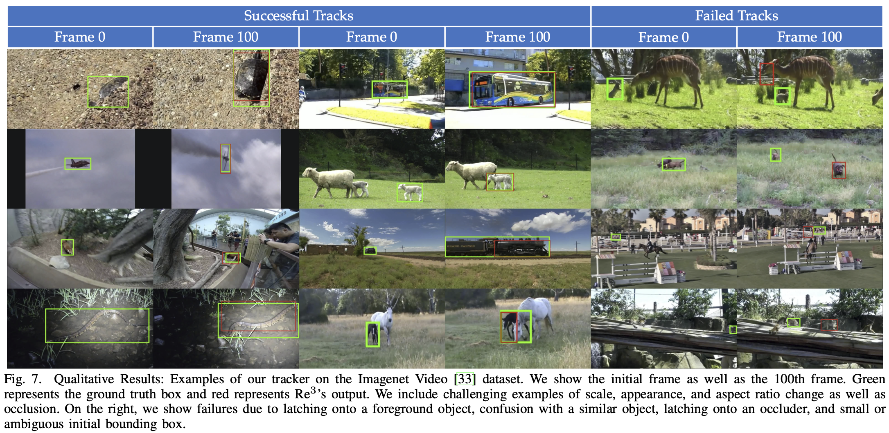

# [DRAFT] Re3: Real-Time Recurrent Regression Networks for Visual Tracking of Generic Objects

- Author
  - Daniel Gordon, Ali Farhadi, Dieter Fox
- Title of Conference
  - IEEE Robotics and Automation Letters (RA-L)
- References
  - [Code](https://gitlab.com/danielgordon10/re3-tensorflow)
  - [YouTube](https://www.youtube.com/watch?v=RByCiOLlxug)

## Abstract

- Robust object tracking을 위해서는 대상체의 모양, 움직임, 시간에 따른 변화를 이해하는 것이 필수적.
  - 따라서 tracer는 새로운 관찰에 맞춰 자신의 모델을 수정할 수 있어야 한다.
  - 이것이 가능한 실시간 deep object tracker인 Re3를 제안.
- 특정 object들만 트래킹하는 것이 아니라 generic tracker를 학습시키고, 효율적으로 tracker를 on-the-fly로 업데이트.
  - 한 번의 forward pass만으로 tracking과 appreance model을 업데이트한다.
  - 높은 성능과 빠른 속도(150fps) 달성.
- 또한 일시적인 occlusion을 다른 tracker들에 비해 잘 다룬다. 

## 1. Introduction

- 주로 로보틱스 분야에서는 알려진 object들이나 특정한 object 객체들을 추적하는 tracker들을 개발해 왔다.
  - 이런 세팅은 tracker들은 offline으로 디자인되거나 학습될 수 있다는 이점이 있고, object들의 shape model이 보통 사용가능할 때도 좋다. 
  - 그러나 많은 시나리오들에서 어떤 object들이 트래킹될지를 미리 특정하는 것은 적절치 않다. 
- 여기서는 RGB 비디오 데이터를 가지고 포괄적인 object tracking을 하는 데 집중한다. 
- 이 논문에서, 우리는 스트리밍 데이터에서 작동하는 tracker만 고려한다.
  - 즉, 주어진 현재 또는 미래의 관찰을 가지고 과거의 추측을 수정할 수 없다. 
- 지금의 포괄적인 2D 이미지 트래킹 시스템들은 대부분 tracker를 온라인으로 학습시키는 데 의존한다. 
- 인기 있는 트래킹 알고리즘 패러다임은 detection을 통한 트래킹이다.
  - Object-specific한 detector를 학습시키고, 각 프레임에서 object의 새로운 모습을 업데이트 하는 식.
  - 이 기법의 단점은 tracker를 업데이트 하는 데 보통 많은 연산이 필요하다는 점이다. 
  - 반대로, 어떤 object tracker들은 dectector를 offline으로 학습시키는 대신 적은 object type들에 대해서만 작동한다. 
- 이러한 단점들을 극복한 빠르고 정확한 generic object tracker, Re3을 제안한다.
  - Re3은 *Re*al-time, *Re*current, *Re*gression-based 이란 뜻.
- SiamFC과 같이, pretrain된 deep neural net을 가지고서 처음 보는 object들에서 작동하는 tracker를 만들 수 있다. 
  - 그러나 SiamFC처럼 네트워크를 고정시켜 놓거나 MDNet처럼 online training을 하는 대신, Re3은 object의 정보를 recurrent parameter들에 저장해 놓는다.
  - 재학습 과정이 전혀 필요하지 않으므로 tracking과 update를 동시에 할 수 있다.

- Re3의 학습 목표는 추적 대상체의 중요한 특징들을 잡아내는 representation을 잘 생성하는 것.
  - 주어진 object가 시간에 따라 어떻게 변할 것 같은지를 학습시켜, 네트워크에 이러한 transformation들을 embed시키는 것이 이 과정의 목표.
  - 이렇게 하면 연산량의 대부분을 offline으로 옮길 수 있어 inference 단계에서 필요한 연산량이 크게 감소한다. 
- Training data가 다양하기 때문에 여러 새로운 환경들(드론 비디오, 핸드폰 미디오, 로봇에 장착된 플랫폼, ...)에 적용 가능.
- Computational cost가 낮아 Re3은 임베디드 시스템에서도 실시간으로 작동 가능.
- 빠르고 정확하며 occlusion들에 대해 robust.
- Multiple tracking 벤치마크에서, occlusion에 대해 특히 좋은 성능을 보이면서도 150fps로 작동. 

## 2. Related Work

- 인기 있는 vision과 robotics 벤치마크 suite인 KITTI는 차와 사람들에 대해서만 성능을 테스트한다. 
  - 여기서는 더 어려운 문제인, 임의의 object에 씌워진 첫 bounding box를 트래킹하는 문제에 집중.
- 대부분의 딥러닝 알고리즘은 high-level concept에 대한 invariance를 학습하는 것을 목표로 한다. 
  - Object detection은 사람이 어떻게 생겼는지를 학습하지, 두 사람을 구분하는 것을 학습하지는 않는다. 
  - 하지만 tracker들은 특정한 target object를 따라가야 한다. 
- 이렇게 딥러닝이 트래킹에 적용되기 힘들기 때문에 최근에 와서야 트래킹에 사용되기 시작했다.
- 우리 연구와 연관된 연구들을 분류하면 다음 세 가지로 분류된다: online-trained, offline-trained, and hybrid trackers.

#### Online-trained trackers

- 가장 널리 사용되는 tracker들은 완전히 online으로 작동하는 것.
  - 새로운 프레임이 올 때마다 관심 object의 feature를 계속해서 학습하며, 보통 이 과정은 빠르게 이루어진다.
  - 매 프레임마다 학습이 진행되므로 속도와 모델의 복잡성 사이에 trade-off가 있다.

#### Offline-trained trackers

- 학습이 offline으로 진행되기에 test time에 빠르다. 
- 그러나 새로운 정보에 적응하지 않는다는 큰 문제점이 있다. 
  - 동영상의 전체적인 정보를 포괄하지 않고, 두 프레임 사이의 유사도 함수를 학습하는 식이다. 
  - 이전 프레임이나 첫 프레임과의 유사도를 비교하기에 occlusion이나 형태 변화에 약하다.

#### Hybrid trackers

- 위 두 방법들의 장점만을 취하려는 시도가 hybrid tracker들.
- MDNet은 classification network를 offline으로 학습시키고, object별 classifier를 online으로 학습시킨다. 
  - 그럼에도 online 학습이 느려 전체적으로 느리게 동작한다.
- 우리의 접근법도 hybrid tracker지만, offline learning을 우선으로 생각하며 online adaption을 recurrent state update로 제한한다. 
  - 이러한 trade-off가 있긴 하지만 이전 프레임들의 정보를 future prediction에 활용한다는 점에서 offline 학습만 사용하는 방법과 크게 다르다.
  - 이렇게 하면 연속적인 이미지들 사이의 시간적 의존성과, occlusion에 대한 고려를 모델링할 수 있다.
- RNN을 사용한 다른 tracker들이 몇몇 있지만 MNIST같은 간단한 데이터셋에서만 작동한다. 
- 우리가 알기론, 우리가 처음으로 natural video에서 RNN을 이용한 tracking을 성공한 첫 사례.

## 3. Method

- Conv layer들이 object의 형태를 embed하고, recurrent layer들이 형태 움직임 정보를 기억하며, regression layer가 object의 위치를 출력한다.
- 진짜 비디오와 합성 데이터를 조합해 네트워크를 학습시켰다.
- MDNet과는 달리 테스트 시에 네트워크 자체를 업데이트하지 않는다.
  - 대신 recurrent parameter로 tracker의 state를 표현하며, 이를 한 번의 forward pass로 update.
  - 이로써 tracker는 새로운 관찰을 가지고 형태와 움직임 모델을 업데이트하면서도 online 학습에 드는 추가적인 비용이 들지 않게 된다. 

### A. Object Appearance Embedding

- Object tracking의 목표는 object에 씌워진 첫 bounding box를 비디오 상에서 계속 따라가는 것.
  - Tracker는 비디오의 각 프레임마다 object의 위치를 잡아 내면서 internal state를 계속해 업데이트해야 한다.
- 주된 subtask는 이미지 데이터를 high-level feature vector representation으로 바꾸는 것.
  - Convolutional pipeline을 이용해 end-to-end로 학습시킨다. 

#### Network Inputs

- 각 프레임마다 네트워크에 한 쌍의 crop들을 넣는다.
  - 첫 crop은 이전 이미지에서 object의 위치를 중심으로 잘라낸 것, 두 번째 crop은 현재 이미지에서 같은 위치를 잘라낸 것.
  - 네트워크에 context를 제공하기 위해 두 crop들 모두 bounding box의 두 배 크기로 잘라낸다.
- 네트워크는 이것을 보고 두 프레임의 차이를 비교해, 움직임이 어떻게 이미지 픽셀에 영향을 미치는지 학습한다.
- object가 다음 프레임에서 1.5배 이상 움직여서 crop 밖으로 벗어날 수도 있지만 가능성이 낮다. 
- crop들이 네트워크에 들어가기 전, 227 × 227로 resize.
  - Source image의 종횡비를 보존하면 성능이 떨어진다는 사실을 실험적으로 확인했다.
- Image feature 쌍은 convolutional pipeline의 마지막에서 concatenate된다.
  - 네트워크가 두 이미지의 차이를 잘 분리할 수 있도록 하기 위해서.

#### Skip Connections

- Conv net은 hierarchical structure를 가지고 있어, 앞쪽에서는 low level feature, 뒤쪽에서는 high level feature를 뽑아낸다는 특징을 가진다.
  - 비슷한 물체들을 구분하기 위해서는 low level과 high level feature들이 모두 필요하므로 skip connection을 두었다. 
- skip connection의 output과 final output이 concat된 다음 fc layer로 들어간다. 

### B. Recurrent Specifications

- 보통 recurrent network는 feed-forward network에 비해 학습시키기 더 어렵다. 
  - Converge하는 데 더 오래 걸리고, 선택해야 할 hyperparameter의 수도 더 많기 때문. 
- 여기서는 recurrent network를 어떻게 tracking에 써먹었는지를 설명한다.
- 또, 네트워크를 더 빨리 수렴시키면서도 좋은 성능을 내도록 하는 학습 기법들을 설명한다. 

#### Recurrent Structure

- Two-layer, factored LSTM (visual feature들이 두 layer들 모두에 들어감) 에 peephole connection을 더한 것을 사용했다. 
  - 이게 one-layer보다 더 잘 작동했다. 
- Object의 모양이 바뀜에 따라 output과 cell state vector가 바뀐다. 
  - 이 embedding은 비디오가 진행함에 따라 서서히 바뀌지만, occlusion이 발생할 때는 크게 바뀌지 않는다.

#### Network Outputs

- 두 번째 LSTM의 출력이 fc layer로 들어가게 되며, 이 fc layer는 object box를 나타내는 네 값을 내놓는다.

#### Unrolling During Training

- 앞서 말했듯, recurrent network는 feed-forward network에 비해 수렴하는 데 더 많은 iteration을 필요로 한다. 
  - 왜냐면 input들이 sequential하게 들어온 다음 하나 또는 여러 개의 output들과 loss들이 생기기 때문.
  - 이것은 loss의 전파가 매우 복잡함을 의미한다. 
- 다행히도 tracking은 각각의 input이 중간 결과에 바로 대응된다. 
  - 따라서 적은 RNN unroll을 통해 네트워크를 학습시키다가, 점차 unroll의 크기를 늘려 나가는 방식의 학습이 가능하다. 
  - 짧은 unroll을 사용하지 않으면 네트워크의 학습 시간이 지수적으로 더 길어지거나 아예 수렴하지 않게 될 수도 있다.
  - loss가 점점 안정됨에 따라 unroll의 크기는 두 배로 늘리고 mini-batch의 크기는 반으로 줄임.
    - 각각 2, 64로 시작해 점차 32, 4까지.

#### Learning to Fix Mistakes

- Recurrent network는 주로 네트워크 스스로의 예측보다는 ground truth output을 사용하는 방식으로 학습시킨다. 
  - 그러나 네트워크에게 매번 ground-truth crop을 주게 되면, test time에 방황하게 되고 object를 track하는 데 실패한다. 
- 이러한 현상을 막기 위해 학습 초기에는 ground truth crop을 주지만, 점점 네트워크가 스스로 예측한 crop을 사용하도록 유도한다. 
  - unroll의 크기를 두 배로 늘릴 때마다 predicted crop을 사용할 확률을 0.25 -> 0.5 -> 0.75로 늘려 간다. 

### C. Training Procedure

- 네트워크를 학습시킬 때 실제 데이터와 합성 데이터를 모두 사용하도록 했다.
  - 다양한 object type에 대해서 잘 작동하도록 하기 위해서. 

#### Training from Video Sequences

- Re3을 두 개의 큰 object tracking 데이터셋에서 학습시켰다. 
- ILSVRC 2016 Object Detection from Video dataset (Imagenet Video)
  - 매우 큰 데이터셋이지만 30개의 object category들밖에 없다. 
- Amsterdam Library of Ordinary Videos 300+ (ALOV)
  - 이 데이터셋의 각 비디오들에는 하나의 object만 존재.

#### Training from Synthetic Sequences

- 최근 많은 연구들에서 학습 데이터를 시뮬레이션이나 합성 데이터를 이용해 보충하고 있다.
- Object detection in iamge 데이터셋이 굉장히 많고 다양하기 때문에, 이를 이용해 고정된 이미지로 합성 비디오를 만들었다. 
  - 전체 이미지 영역에서  보다 작은 object들은 detail이 부족해 폐기했다. 
- 모든 이미지들에 대해, track할 object를 랜덤으로 샘플링하고, 역시 같은 이미지에 대해 occluder patch들을 랜덤으로 뽑는다.
- 그런 다음 object와 occluder의 움직임을 시뮬레이션한다. 
  - 매 timestep마다 초기 속도, 방향, 종횡비를 Gaussian noise에 따라 수정한다. 
- 이 데이터는 네트워크가 보는 object들의 다양성을 더해 준다. 
  - 예로 "사람"과 같은 카테고리는 많은 tracking 데이터셋에서 흔하게 나오지만 Imagenet Video에는 존재하지 않는다. 

#### Tracking at Test Time

- Test-time prediction을 생성하기 위해 각 연속된 프레임들의 crop들을 network에 넣는다.
- 매 32번의 iteration마다 LSTM state를 리셋한다. 
  - 이는 필수적인데, 학습 과정에서 사용한 비디오들의 최대 길이가 32 프레임이었기 때문.
  - 리셋을 하지 않으면 LSTM 파라미터들이 이전에 보지 못한 값으로 diverge한다. 
- LSTM state들을 전부 0으로 리셋하는 대신 첫 forward pass의 ouput으로 리셋했다.
  - 이 방법은 따라갈 object의 encoding을 유지하면서, training unroll의 수보다 훨씬 긴 비디오에서도 잘 작동하게 해 준다.
- 또한 리셋은 모델이 위치를 제대로 잡지 못하고 있을 때 복구하는 데 도움을 준다.
  - well-centered crop embedding을 다시 사용하게 되기 때문.

#### Implementation Details

- (생략)

## 4. Experiments

- 몇 유명한 tracking dataset들에서 전체적인 성능, occlusion에 대한 robustness를 다른 tracker들과 비교했다. 

### A. VOT 2014 and 2016

- 이 데이터셋의 많은 비디오들이 모양에서의 큰 변화, 강한 occlusion, 그리고 카메라 움직임과 같은 어려움을 포함하고 있다. 
- 여기서 다른 tracker들과 accuracy (predicted box가 ground truth와 얼마나 잘 맞는지), robustness (얼마나 자주 tracker가 실패해서 reset되지 않는지) 를 비교했다. 

- Fig. 3은 각 연도에서 제출됐던 가장 빠른 tracker 10개와 가장 정확한 tracker 10개를 Re3와 비교한 것이다. 
- Fig. 3의 왼쪽을 보면 Re3가 전체적으로 가장 정확한 편에 속하면서, real-time tracker들 중 robustness도 뛰어나다. 
  - 이는 LSTM이 시간에 따른 변화를 직접적으로 모델링하면서도 연산적 오버헤드는 별로 없었기 때문인 것으로 보인다.
- Fig. 3의 오른쪽은 좀 더 최근의 tracker들을, 더 어려운 VOT 2016 test set에서 비교한 것이다. 
  - 여기에서 사용된 tracker는 ALOV 데이터를 완전히 빼고 학습시켰는데, 이는 두 비디오 셋 사이에 겹치는 부분이 너무 많았기 때문이다. 
  - 이렇게 하지 않으면 성능이 떨어졌는데, 자세한 내용은 뒤의 abalation analysis 부분에.
  - Re3은 C-COT와 같은 가장 좋은 방법들보다 450배나 빠르면서도 상대적 accuracy와 robustness는 각각 20%, 5%밖에 낮은 데 그쳤다. 
- 두 데이터셋 모두에서 Re3은 speed, accuracy, robustness 사이의 trade-off 관계를 보였다. 
  - 특히 time-critical하거나 연산량이 제한된 시나리오들에서. 

### B. Imagenet Video

- Imagenet Video 데이터셋에서 평가할 때는 track에 실패하더라도 (lose track) tracker를 초기화시키지 않았다. 
- 다양한 IOU threshold에 따른 성능을, 다른 real-time tracker들과 비교. 

- Fig. 4를 보면 Re3가 다른 real-time method들에 비해 높은 성능을 냄을 확인할 수 있다. 
  - Re3와 GOTURN + Imagenet은 Imagenet Video 데이터셋에서만 학습시켰음에도 불구하고. 
- Re3를 Imagenet Video 데이터 없이 ALOV와 시뮬레이션 데이터로만 학습시켰을 때는 훨신 낮은 결과를 보였다. 
  - LSTM의 학습에는 feed forward network들에 비해 더 많은 데이터가 필요한데, Imagenet Video를 뺌으로써 90%의 학습 데이터가 제거되었기 때문인 것 같다. 
  - 충분한 데이터만 제공된다면, 같은 데이터에서 학습시킨 다른 method들을 뛰어넘는 성능을 보인다. 

### C. Online Object Tracking Benchmark

- OTB에서, Imagenet Video에서의 평가 지표와 같은 지표인 OPE (One Pass Evaluation) 를 가지고 비교했다. 
- 여기서는 ALOV 데이터를 빼고 학습시킨 네트워크를 사용했으며, 그럼에도 baseline들보다 좋은 결과를 냈다. 

### D. Robustness to Occlusion

- Occlusion에 대해서 얼마나 잘 작동하는지를 나타내는 두 개의 추가 실험을 진행했다. 
- LSTM은 implicit하게 occlusion을 다루는 것을 학습할 수 있다. 
  - 구조상, input과 forget gate를 통해 정보를 무시할 수 있기 때문. 
  - 이는 모든 observation이 유용할 것이라고 가정하는 다른 방법들과는 대비되는 특성이다. 

 

- Fig. 5는 영상 전체와, occlusion이 존재하는 동안의 expected overlap의 차이를 비교한 것이다. 
- Re3은 훨씬 높은 frame rate를 보이면서도 다른 top performer들과 비슷한 성능을 낸다. 
- 그리고 occlusion이 있을 때는 적은 성능 감소를 보여, 많은 tracker들보다 좋은 성능을 낸다. 
  - 다른 많은 tracker들은 25% 이상의 성능 감소를 보인다. 
- 또한 OTB에서도 occlusion이 있을 때와 없을 때를 비교했는데, 여기서도 다른 method들에 비해 정확도 감소가 더 적게 일어났다. 
  - 이 결과는 위에 있는 fig. 6 의 오른쪽 그래프에. 
- 즉, object tracking에서 가장 해결하기 어려운 문제인 occlusion에 대한 해법으로 우리의 LSTM 기반의 method가 사용될 수 있다. 

### E. Ablation Study

- Table 1은 Re3 network에 다양한 변화를 줬을 때의 속도와 성능 변화를 나타낸 것이다. 
- 모델 A와 C의 차이점.
  - 모델 A는 각각 4096개의 출력을 갖는 fc layer가 세 개 있지만, 
  - 모델 C는 2048개의 출력을 갖는 fc layer가 한 개만 있고 1024개의 출력을 갖는 LSTM layer가 하나 있다. 
- 이런 작은 차이에도 불구하고, 별도의 수정 없이 기존의 tracker에 학습 과정에서 LSTM을 추가하는 것만으로도 성능이 감소됐다.
- 이전 실수들을 정정하고 drift를 막는 방법인 self-training를 C에다 더한 모델인 D번 모델을 보면, self-training이 필수적임을 볼 수 있다. 
- 다른 수정본들에서는 속도를 조금 희생했더니 accuracy와 robustness 모두 올라가는 경향을 보였다. 
- 모델 K는 image embedding에 GoogleNet을 이용했는데 두 배나 느려졌다. 
- 모델 H는 Imagenet Video와 시뮬레이션 데이터만 가지고 학습시켰다.
  - 고정된 클래스 셋에서 학습시켰더니 성능이 해당 클래스에 대해서는 올라가지만 나머지에 대해서는 크게 감소했다. 
- 모델 I는 큰 학습 데이터셋을 사용하는 것이 높은 robustness 달성에 필수적임을 보여준다. 
- 모델 J는 LSTM state reset이 parameter나 model drift보다 성능에 더 큰 부정적 영향을 줌을 확인시켜 준다.

### F. Qualitative Results

- 모델이 보지 못한 object들에 대한 tracking도 잘 수행했다. 
-  픽셀 정도의 작은 object들이 포함된 비디오에서도 작동했다.
- [유튜브 영상](https://www.youtube.com/watch?v=RByCiOLlxug) 참조. 

## V. Conclusion

- 처음으로 generic object tracker를 RNN을 사용해서 구현했다. 
- 많은 예제들을 offline으로 학습하고, 특정한 object를 따라갈 때는 빠르게 online update를 하는 강력한 방법.
- 특히 occlusion이 있는 상황에서 accuracy, robustness, 그리고 speed를 높일 수 있었다. 
- Labeled video와 합성 데이터로 recurrent network를 효율적이고 효과적으로 학습시키는 방법을 보였다.
- RNN이 빠른 generic object tracking 분야에서 굉장한 잠재력이 있음을 보였고, 제한된 연산량으로도 실시간성을 달성해야 하는 로보틱스 분야에서 유익할 것으로 생각한다. 