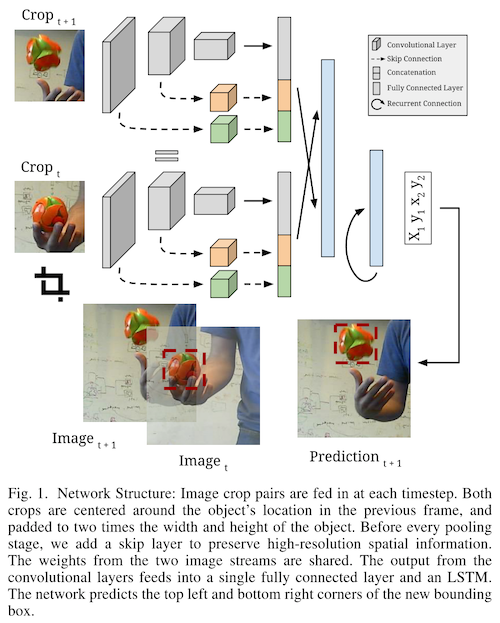

# [DRAFT] Re3: Real-Time Recurrent Regression Networks for Visual Tracking of Generic Objects

- Author
  - Daniel Gordon, Ali Farhadi, Dieter Fox
- Title of Conference
  - IEEE Robotics and Automation Letters (RA-L)
- References
  - [Code](https://gitlab.com/danielgordon10/re3-tensorflow)
  - [YouTube](https://www.youtube.com/watch?v=RByCiOLlxug)

## Abstract

- Robust object tracking을 위해서는 대상체의 모양, 움직임, 시간에 따른 변화를 이해하는 것이 필수적.
  - 따라서 tracer는 새로운 관찰에 맞춰 자신의 모델을 수정할 수 있어야 한다.
  - 이것이 가능한 실시간 deep object tracker인 Re3를 제안.
- 특정 object들만 트래킹하는 것이 아니라 generic tracker를 학습시키고, 효율적으로 tracker를 on-the-fly로 업데이트.
  - 한 번의 forward pass만으로 tracking과 appreance model을 업데이트한다.
  - 높은 성능과 빠른 속도(150fps) 달성.
- 또한 일시적인 occlusion을 다른 tracker들에 비해 잘 다룬다. 

## 1. Introduction

- 주로 로보틱스 분야에서는 알려진 object들이나 특정한 object 객체들을 추적하는 tracker들을 개발해 왔다.
  - 이런 세팅은 tracker들은 offline으로 디자인되거나 학습될 수 있다는 이점이 있고, object들의 shape model이 보통 사용가능할 때도 좋다. 
  - 그러나 많은 시나리오들에서 어떤 object들이 트래킹될지를 미리 특정하는 것은 적절치 않다. 
- 여기서는 RGB 비디오 데이터를 가지고 포괄적인 object tracking을 하는 데 집중한다. 
- 이 논문에서, 우리는 스트리밍 데이터에서 작동하는 tracker만 고려한다.
  - 즉, 주어진 현재 또는 미래의 관찰을 가지고 과거의 추측을 수정할 수 없다. 
- 지금의 포괄적인 2D 이미지 트래킹 시스템들은 대부분 tracker를 온라인으로 학습시키는 데 의존한다. 
- 인기 있는 트래킹 알고리즘 패러다임은 detection을 통한 트래킹이다.
  - Object-specific한 detector를 학습시키고, 각 프레임에서 object의 새로운 모습을 업데이트 하는 식.
  - 이 기법의 단점은 tracker를 업데이트 하는 데 보통 많은 연산이 필요하다는 점이다. 
  - 반대로, 어떤 object tracker들은 dectector를 offline으로 학습시키는 대신 적은 object type들에 대해서만 작동한다. 
- 이러한 단점들을 극복한 빠르고 정확한 generic object tracker, Re3을 제안한다.
  - Re3은 *Re*al-time, *Re*current, *Re*gression-based 이란 뜻.
- SiamFC과 같이, pretrain된 deep neural net을 가지고서 처음 보는 object들에서 작동하는 tracker를 만들 수 있다. 
  - 그러나 SiamFC처럼 네트워크를 고정시켜 놓거나 MDNet처럼 online training을 하는 대신, Re3은 object의 정보를 recurrent parameter들에 저장해 놓는다.
  - 재학습 과정이 전혀 필요하지 않으므로 tracking과 update를 동시에 할 수 있다.

- Re3의 학습 목표는 추적 대상체의 중요한 특징들을 잡아내는 representation을 잘 생성하는 것.
  - 주어진 object가 시간에 따라 어떻게 변할 것 같은지를 학습시켜, 네트워크에 이러한 transformation들을 embed시키는 것이 이 과정의 목표.
  - 이렇게 하면 연산량의 대부분을 offline으로 옮길 수 있어 inference 단계에서 필요한 연산량이 크게 감소한다. 
- Training data가 다양하기 때문에 여러 새로운 환경들(드론 비디오, 핸드폰 미디오, 로봇에 장착된 플랫폼, ...)에 적용 가능.
- Computational cost가 낮아 Re3은 임베디드 시스템에서도 실시간으로 작동 가능.
- 빠르고 정확하며 occlusion들에 대해 robust.
- Multiple tracking 벤치마크에서, occlusion에 대해 특히 좋은 성능을 보이면서도 150fps로 작동. 

## 2. Related Work

- 인기 있는 vision과 robotics 벤치마크 suite인 KITTI는 차와 사람들에 대해서만 성능을 테스트한다. 
  - 여기서는 더 어려운 문제인, 임의의 object에 씌워진 첫 bounding box를 트래킹하는 문제에 집중.
- 대부분의 딥러닝 알고리즘은 high-level concept에 대한 invariance를 학습하는 것을 목표로 한다. 
  - Object detection은 사람이 어떻게 생겼는지를 학습하지, 두 사람을 구분하는 것을 학습하지는 않는다. 
  - 하지만 tracker들은 특정한 target object를 따라가야 한다. 
- 이렇게 딥러닝이 트래킹에 적용되기 힘들기 때문에 최근에 와서야 트래킹에 사용되기 시작했다.
- 우리 연구와 연관된 연구들을 분류하면 다음 세 가지로 분류된다: online-trained, offline-trained, and hybrid trackers.

#### Online-trained trackers

- 가장 널리 사용되는 tracker들은 완전히 online으로 작동하는 것.
  - 새로운 프레임이 올 때마다 관심 object의 feature를 계속해서 학습하며, 보통 이 과정은 빠르게 이루어진다.
  - 매 프레임마다 학습이 진행되므로 속도와 모델의 복잡성 사이에 trade-off가 있다.

#### Offline-trained trackers

- 학습이 offline으로 진행되기에 test time에 빠르다. 
- 그러나 새로운 정보에 적응하지 않는다는 큰 문제점이 있다. 
  - 동영상의 전체적인 정보를 포괄하지 않고, 두 프레임 사이의 유사도 함수를 학습하는 식이다. 
  - 이전 프레임이나 첫 프레임과의 유사도를 비교하기에 occlusion이나 형태 변화에 약하다.

#### Hybrid trackers

- 위 두 방법들의 장점만을 취하려는 시도가 hybrid tracker들.
- MDNet은 classification network를 offline으로 학습시키고, object별 classifier를 online으로 학습시킨다. 
  - 그럼에도 online 학습이 느려 전체적으로 느리게 동작한다.
- 우리의 접근법도 hybrid tracker지만, offline learning을 우선으로 생각하며 online adaption을 recurrent state update로 제한한다. 
  - 이러한 trade-off가 있긴 하지만 이전 프레임들의 정보를 future prediction에 활용한다는 점에서 offline 학습만 사용하는 방법과 크게 다르다.
  - 이렇게 하면 연속적인 이미지들 사이의 시간적 의존성과, occlusion에 대한 고려를 모델링할 수 있다.
- RNN을 사용한 다른 tracker들이 몇몇 있지만 MNIST같은 간단한 데이터셋에서만 작동한다. 
- 우리가 알기론, 우리가 처음으로 natural video에서 RNN을 이용한 tracking을 성공한 첫 사례.

## 3. Method

- Conv layer들이 object의 형태를 embed하고, recurrent layer들이 형태 움직임 정보를 기억하며, regression layer가 object의 위치를 출력한다.
- 진짜 비디오와 합성 데이터를 조합해 네트워크를 학습시켰다.
- MDNet과는 달리 테스트 시에 네트워크 자체를 업데이트하지 않는다.
  - 대신 recurrent parameter로 tracker의 state를 표현하며, 이를 한 번의 forward pass로 update.
  - 이로써 tracker는 새로운 관찰을 가지고 형태와 움직임 모델을 업데이트하면서도 online 학습에 드는 추가적인 비용이 들지 않게 된다. 

### A. Object Appearance Embedding

- Object tracking의 목표는 object에 씌워진 첫 bounding box를 비디오 상에서 계속 따라가는 것.
  - Tracker는 비디오의 각 프레임마다 object의 위치를 잡아 내면서 internal state를 계속해 업데이트해야 한다.
- 주된 subtask는 이미지 데이터를 high-level feature vector representation으로 바꾸는 것.
  - Convolutional pipeline을 이용해 end-to-end로 학습시킨다. 

#### Network Inputs

- 각 프레임마다 네트워크에 한 쌍의 crop들을 넣는다.
  - 첫 crop은 이전 이미지에서 object의 위치를 중심으로 잘라낸 것, 두 번째 crop은 현재 이미지에서 같은 위치를 잘라낸 것.
  - 네트워크에 context를 제공하기 위해 두 crop들 모두 bounding box의 두 배 크기로 잘라낸다.
- 네트워크는 이것을 보고 두 프레임의 차이를 비교해, 움직임이 어떻게 이미지 픽셀에 영향을 미치는지 학습한다.
- object가 다음 프레임에서 1.5배 이상 움직여서 crop 밖으로 벗어날 수도 있지만 가능성이 낮다. 
- crop들이 네트워크에 들어가기 전, 227 × 227로 resize.
  - Source image의 종횡비를 보존하면 성능이 떨어진다는 사실을 실험적으로 확인했다.
- Image feature 쌍은 convolutional pipeline의 마지막에서 concatenate된다.
  - 네트워크가 두 이미지의 차이를 잘 분리할 수 있도록 하기 위해서.

#### Skip Connections

### B. Recurrent Specifications

#### Recurrent Structure

#### Network Outputs

#### Unrolling During Training

#### Learning to Fix Mistakes

### C. Training Procedure

#### Training from Video Sequences

#### Training from Synthetic Sequences

#### Tracking at Test Time

#### Implementation Details